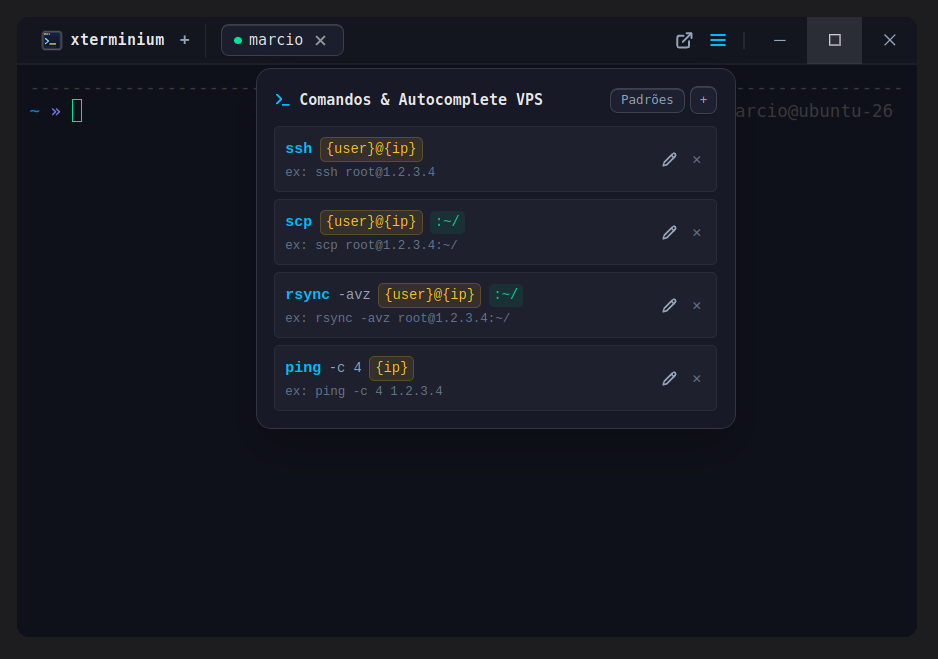
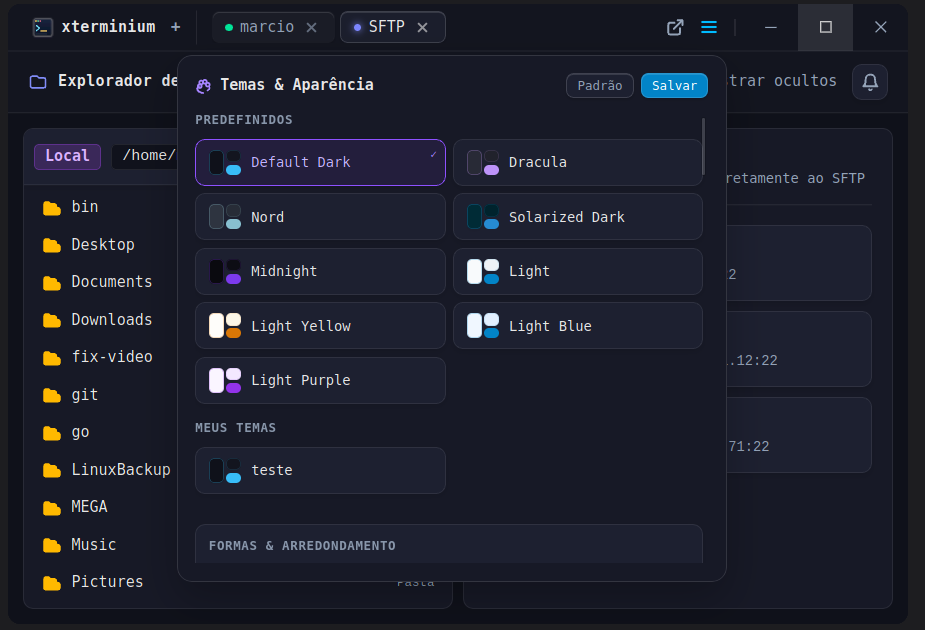
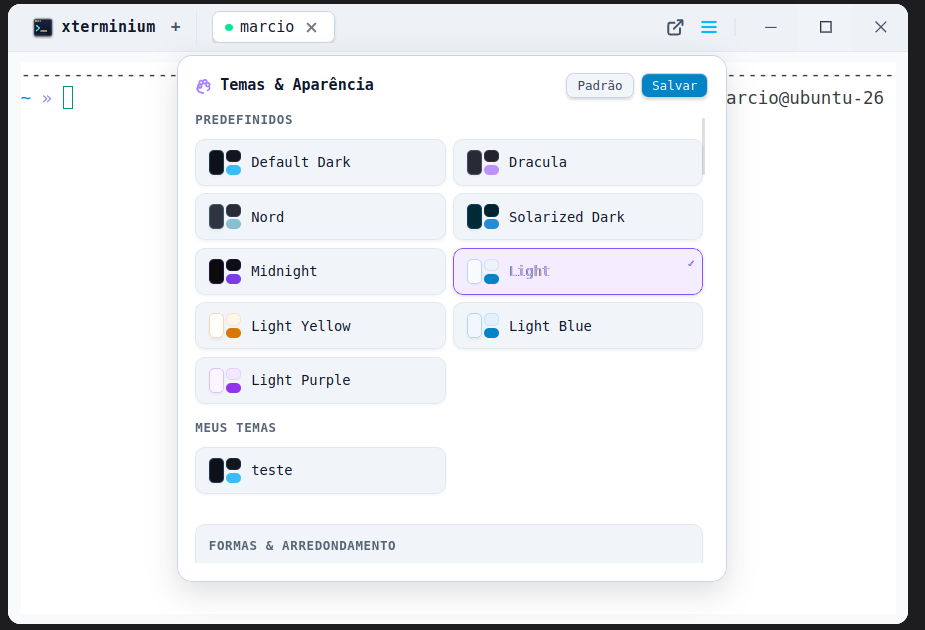

# xterminium

A terminal emulator built with Tauri v2 (Rust) and Svelte 5. Focuses on SSH/SFTP workflows, keyboard-driven navigation, and low overhead.

---

<p align="center">
  
</p>

<p align="center">
  
  
</p>

<p align="center">
  
  
</p>

<p align="center">
  
  
</p>

---

## Install (Linux)

```bash
bash <(curl -fsSL https://raw.githubusercontent.com/Josemarcio15/xterminium/main/install.sh)
```

Fetches the latest release from GitHub, downloads the `.deb`, and installs via `dpkg`. Exits early if already up to date. Requires `curl`, `dpkg`, and `sudo`.

---

## Features

**Local terminal**
- Detects `$SHELL` on Linux/macOS; falls back through `zsh → bash → sh`
- On Windows, starts PowerShell with `cmd.exe` fallback
- Full ANSI 256-color and TrueColor support via xterm.js
- Multiple independent tabs

**SSH manager**
- Save hosts with label, user, IP, port, and private key (`.pem` / `id_rsa`)
- `Ctrl+Space` autocomplete inside any `ssh` or `scp` command

**SFTP file manager**
- Dual-pane (local ↔ remote) as a native tab — no modal
- Recursive upload/download with progress tracking
- Toggle hidden files; keyboard navigation throughout

**Shortcuts** — all configurable, stored in `~/.config/xterminium/shortcuts.json`

| Action | Default |
|---|---|
| Copy | `Ctrl+Shift+C` |
| Paste | `Ctrl+Shift+V` |
| Select all | `Ctrl+Shift+A` |
| SSH autocomplete | `Ctrl+Space` |
| New tab | `Ctrl+Shift+T` |
| New window | `Ctrl+Shift+N` |

**Quick paths** — bookmark local directories for instant `cd` from the terminal.

---

## Stack

| Layer | Technology |
|---|---|
| Backend | Rust · Tauri v2 |
| PTY | `portable-pty` |
| SSH/SFTP | `russh` · `russh-sftp` (pure Rust, no system deps) |
| Frontend | Svelte 5 · TypeScript · Vite |
| Styles | Tailwind CSS v4 |
| Terminal | xterm.js |

---

## Development

**Prerequisites**

- Node.js 18+
- Rust (stable)
- System libraries (Ubuntu/Debian):

```bash
sudo apt install libwebkit2gtk-4.1-dev build-essential curl wget file \
  libxdo-dev libssl-dev libayatana-appindicator3-dev librsvg2-dev
```

**Run**

```bash
git clone https://github.com/Josemarcio15/xterminium.git
cd xterminium
npm install
npm run tauri dev
```

**Build**

```bash
npm run tauri build
# output: src-tauri/target/release/bundle/
```

---

## Shell setup (optional)

To match the prompt shown in the screenshots, install [Oh My Zsh](https://ohmyz.sh/) and set `ZSH_THEME="af-magic"` in `~/.zshrc`. A [Nerd Font](https://www.nerdfonts.com/) (JetBrains Mono or Fira Code) is recommended for glyph rendering.

---

## License

MIT
