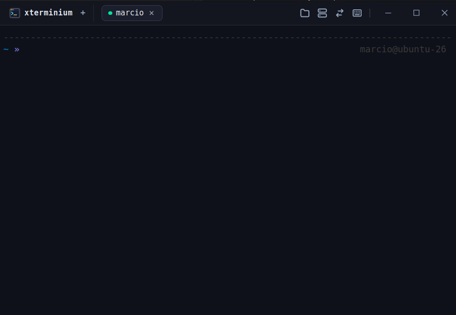
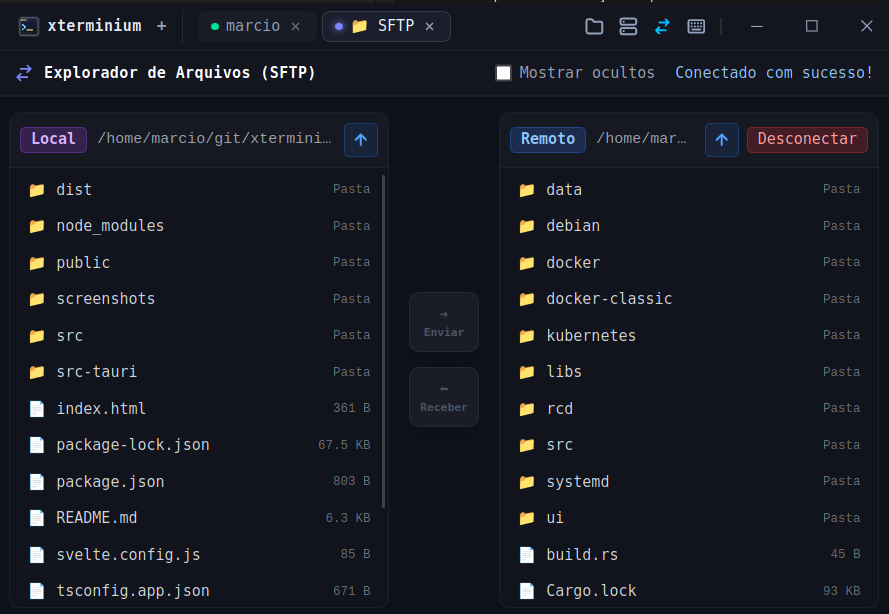
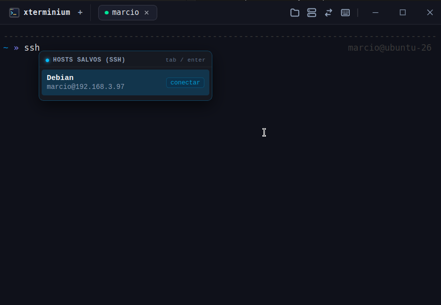
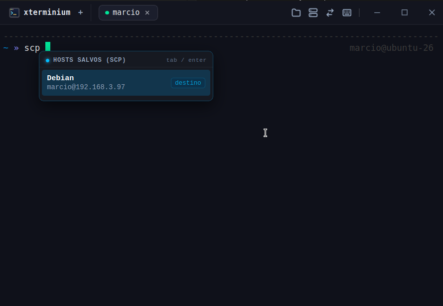
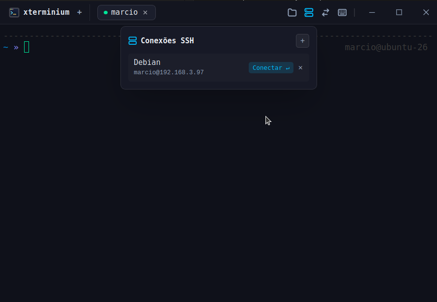
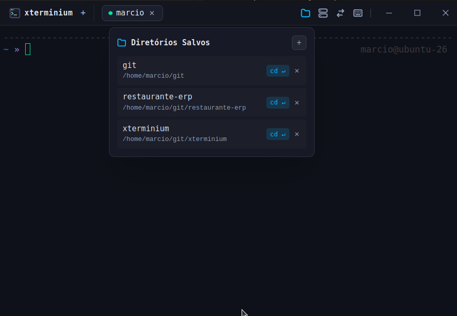
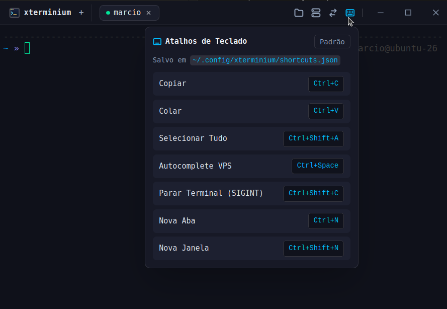

# ⚡ xterminium

> **Um emulador de terminal moderno, ultra-rápido e focado em produtividade para desenvolvedores e administradores de servidores.**  
> Construído nativamente com **Tauri v2 (Rust)**, **Svelte 5** e renderização de alta performance via **xterm.js**.

---

## 📸 Screenshots

<p align="center">
  <b>Terminal Principal com Shell Zsh & af-magic</b><br/>
  
</p>

<p align="center">
  <b>Explorador de Arquivos & SFTP Integrado (Dual-Pane)</b><br/>
  
</p>

<p align="center">
  
  
</p>

<p align="center">
  
  
  
</p>

---

## 🎨 Como obter o mesmo visual dos prints

Para obter a aparência idêntica demonstrada nas capturas de tela (prompt estilizado com caminho, status do git e setas):

### 1. Instalar o Zsh & Oh My Zsh
Se ainda não tiver o Zsh instalado:
```bash
# Ubuntu / Debian
sudo apt install zsh curl git -y

# Definir como shell padrão (opcional)
chsh -s $(which zsh)
```

Instale o **Oh My Zsh**:
```bash
sh -c "$(curl -fsSL https://raw.githubusercontent.com/ohmyzsh/ohmyzsh/master/tools/install.sh)"
```

### 2. Ativar o Tema Oficial (`af-magic`)
O visual exibido no terminal utiliza o tema **`af-magic`** nativo do Oh My Zsh:
1. Abra o arquivo de configuração `~/.zshrc`:
   ```bash
   nano ~/.zshrc
   ```
2. Localize a linha `ZSH_THEME` e configure para:
   ```bash
   ZSH_THEME="af-magic"
   ```
3. Salve o arquivo e recarregue:
   ```bash
   source ~/.zshrc
   ```

*(Opcional - Oh My Posh)*: Se preferir utilizar o **Oh My Posh** no Windows ou Linux:
```bash
# Instalar Oh My Posh
curl -s https://ohmyposh.dev/install.sh | bash -s

# Adicione no final do seu ~/.zshrc ou $PROFILE do PowerShell:
eval "$(oh-my-posh init zsh --theme <nome-do-tema>)"
```

### 3. Fonte Recomendada (Nerd Font)
Para os ícones e glifos renderizarem perfeitamente no terminal sem quebra, recomendamos uma fonte Nerd Font:
- **JetBrains Mono Nerd Font** ou **Fira Code Nerd Font**

---

## ✨ Principais Funcionalidades

### 💻 1. Terminal Local & Detecção Inteligente de Shell
- **Compatibilidade Cross-Platform:** Funciona nativamente em Linux e Windows.
- **Detecção Automática:**
  - No **Linux/macOS**: Identifica sua preferência em `$SHELL`. Caso não esteja configurado, tenta em sequência `zsh` ➔ `bash` ➔ `sh`.
  - No **Windows**: Inicia automaticamente no `PowerShell` nativo com fallback para `cmd.exe`.
- **Renderização Acelerada:** Baseado no xterm.js com suporte completo a cores ANSI 256 e TrueColor.
- **Abas Independentes:** Abra múltiplos terminais locais e sessões SSH sem travar a interface.

### 🌐 2. Gerenciador de Servidores SSH & Autocomplete Dinâmico
- **Cadastro de Servidores/VPS:** Salve seus hosts com apelido (label), usuário, IP, porta customizada e chave privada (`.pem` / `id_rsa`).
- **Autocomplete Inteligente (`Ctrl+Space`):**
  - No meio de qualquer comando `ssh` ou `scp`, pressione `Ctrl+Space` para abrir um menu suspenso de servidores salvos.
  - O terminal preenche automaticamente o comando no ponto do cursor.
- **Conexão com 1 Clique:** Conecte diretamente aos servidores com chaves privadas customizadas ou autenticação via `ssh-agent`.

### 📁 3. Explorador de Arquivos Integrado & SFTP Puro (Dual-Pane)
- **Aba Nativa SFTP:** O explorador abre como uma aba nativa do terminal, permitindo que você navegue entre código, servidores e arquivos sem perder o estado da conexão.
- **Painel Duplo:**
  - **Local (Esquerda):** Navegue pelas pastas do seu próprio computador.
  - **Remoto (Direita):** Conecte com 1 clique a qualquer servidor salvo.
- **Transferência Rápida de Arquivos e Pastas:**
  - Seleção visual com destaque em azul.
  - Suporte completo a **upload e download recursivo de diretórios inteiros** (inclusive pastas pesadas com milhares de arquivos).
  - Envio e recebimento seguros com buffers otimizados e controle estrito de handles OpenSSH.
- **Filtro de Ocultos:** Checkbox para alternar visibilidade de arquivos ocultos (`.`).
- **Navegação Rápida:** Botão para subir de diretório estilizado e com suporte a atalhos de teclado.

### ⌨️ 4. Atalhos de Teclado Totalmente Customizáveis
Gerenciamento de atalhos persistido em `~/.config/xterminium/shortcuts.json`:
- **Copiar:** `Ctrl+Shift+C` *(copia com seleção inteligente sem quebrar o Ctrl+C de interrupção)*
- **Colar:** `Ctrl+Shift+V`
- **Selecionar Tudo:** `Ctrl+Shift+A` *(seleciona todo o histórico do terminal)*
- **Autocomplete VPS:** `Ctrl+Space` *(configurável)*
- **Parar Terminal (SIGINT):** `Ctrl+C`
- **Nova Aba:** `Ctrl+Shift+T`
- **Nova Janela:** `Ctrl+Shift+N`

### 📂 5. Pastas Favoritas (Quick Paths)
- Salve atalhos de diretórios locais frequentemente usados para navegação instantânea pelo terminal.

---

## 🛠️ Tecnologias Utilizadas

- **Backend:** [Rust](https://www.rust-lang.org/) + [Tauri v2](https://v2.tauri.app/)
  - `portable-pty`: Gerenciamento de pseudoterminais nativos do sistema operacional.
  - `russh` & `russh-sftp`: Implementação pura e segura em Rust para sessões SSH e transferências SFTP sem dependências externas (não requer `rsync` ou `sshfs`).
- **Frontend:** [Svelte 5](https://svelte.dev/) + [Vite](https://vite.dev/) + [TypeScript](https://www.typescriptlang.org/)
- **Estilos:** [Tailwind CSS v4](https://tailwindcss.com/)
- **Terminal Engine:** [@xterm/xterm](https://xtermjs.org/) + addons

---

## 🚀 Como Rodar Localmente

### Pré-requisitos
- [Node.js](https://nodejs.org/) (versão 18+)
- [Rust & Cargo](https://rustup.rs/) (versão 1.77.2+)
- Dependências de sistema no Linux (Ubuntu/Debian):
  ```bash
  sudo apt install libwebkit2gtk-4.1-dev build-essential curl wget file libxdo-dev libssl-dev libayatana-appindicator3-dev librsvg2-dev
  ```

### Instalação e Desenvolvimento
```bash
# 1. Clone o repositório
git clone https://github.com/Josemarcio15/xterminium.git
cd xterminium

# 2. Instale as dependências do frontend
npm install

# 3. Execute em modo de desenvolvimento (Live Reload + Tauri Dev)
npm run tauri dev
```

### Compilando o Pacote de Produção
```bash
npm run tauri build
```
O executável compilado e o instalador `.deb` (ou `.exe` no Windows) estarão em `src-tauri/target/release/bundle/`.

---

## 📄 Licença

Distribuído sob a licença **MIT**. Consulte `LICENSE` para mais informações.
