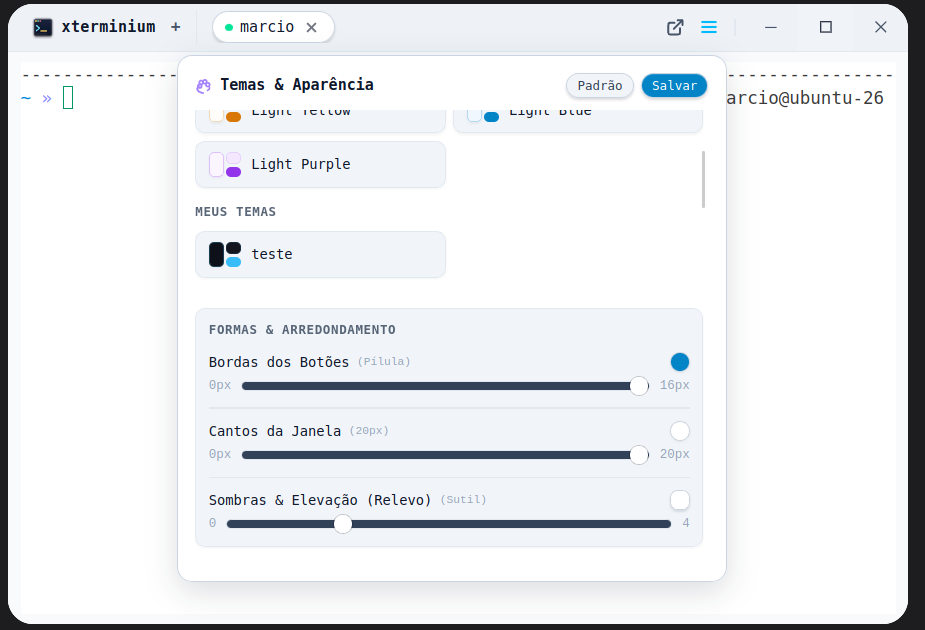

# xterminium

<p align="left">
  <a href="https://tauri.app/"></a>
  <a href="https://www.rust-lang.org/"></a>
  <a href="https://svelte.dev/"></a>
  <a href="https://www.typescriptlang.org/"></a>
  <a href="https://tailwindcss.com/"></a>
  <a href="https://vite.dev/"></a>
  <a href="https://xtermjs.org/"></a>
</p>

A terminal emulator built with Tauri v2 (Rust) and Svelte 5, designed for SSH and SFTP workflows, keyboard-driven navigation, and minimal system overhead.

---

## Screenshots

<p align="center">
  <b>Integrated File Explorer & Dual-Pane SFTP</b><br/>
  
</p>

<p align="center">
  <b>SCP Autocomplete</b><br/>
  
</p>

<p align="center">
  <b>Saved SSH Connections</b><br/>
  
</p>

<p align="center">
  <b>Saved Paths</b><br/>
  
</p>

<p align="center">
  <b>Commands & Configurable VPS Autocomplete</b><br/>
  
</p>

<p align="center">
  <b>Theme & Appearance Customization</b><br/>
  
</p>

<p align="center">
  
</p>

<p align="center">
  
</p>

---

## Installation

### Linux
```bash
bash <(curl -fsSL https://raw.githubusercontent.com/Josemarcio15/xterminium/main/install.sh)
```
Fetches the latest release from GitHub Releases, downloads the `.deb` package, and installs it via `dpkg`. Exits early if the application is already up to date. Requires `curl`, `dpkg`, and `sudo`.

### Windows
Open **PowerShell** and run:
```powershell
irm https://raw.githubusercontent.com/Josemarcio15/xterminium/main/install.ps1 | iex
```
Checks for the latest version on GitHub Releases, downloads the installer, and handles installation/updates automatically.

---

## Features

**Local Terminal**
- Automatically detects `$SHELL` on Linux/macOS with fallback chain (`zsh -> bash -> sh`)
- Starts PowerShell with `cmd.exe` fallback on Windows
- Full ANSI 256-color and TrueColor support powered by xterm.js
- Multiple independent tabs

**SSH Manager**
- Save connection profiles with label, user, host/IP, port, and private key (`.pem` / `id_rsa`)
- `Ctrl+Space` autocomplete within `ssh` and `scp` commands

**SFTP File Manager**
- Dual-pane (local <-> remote) file transfer interface opened directly as a tab
- Recursive upload and download with progress indicators
- Hidden files visibility toggle and full keyboard navigation

**Configurable Shortcuts** — customizable via `~/.config/xterminium/shortcuts.json`

| Action | Default Shortcut |
|---|---|
| Copy | `Ctrl+Shift+C` |
| Paste | `Ctrl+Shift+V` |
| Select all | `Ctrl+Shift+A` |
| SSH autocomplete | `Ctrl+Space` |
| New tab | `Ctrl+Shift+T` |
| New window | `Ctrl+Shift+N` |

**Quick Paths** — bookmark directories for instant `cd` navigation from the terminal.

---

## Tech Stack

| Layer | Technology |
|---|---|
| Backend | Rust, Tauri v2 |
| PTY | `portable-pty` |
| SSH / SFTP | `russh`, `russh-sftp` (pure Rust, no system C library dependencies) |
| Frontend | Svelte 5, TypeScript, Vite |
| Styling | Tailwind CSS v4 |
| Terminal Core | xterm.js |

---

## Development

### Prerequisites

- Node.js 18+
- Rust (stable toolchain)
- Required system dependencies (Ubuntu/Debian):

```bash
sudo apt install libwebkit2gtk-4.1-dev build-essential curl wget file \
  libxdo-dev libssl-dev libayatana-appindicator3-dev librsvg2-dev
```

### Running Locally

```bash
git clone https://github.com/Josemarcio15/xterminium.git
cd xterminium
npm install
npm run tauri dev
```

### Building for Production

```bash
npm run tauri build
# Artifacts will be generated in: src-tauri/target/release/bundle/
```

---

## Shell Setup (Optional)

To achieve the terminal prompt displayed in the screenshots, install [Oh My Zsh](https://ohmyz.sh/) and configure `ZSH_THEME="af-magic"` in your `~/.zshrc`. A [Nerd Font](https://www.nerdfonts.com/) such as JetBrains Mono or Fira Code is recommended for proper icon and glyph rendering.

---

## License

MIT
